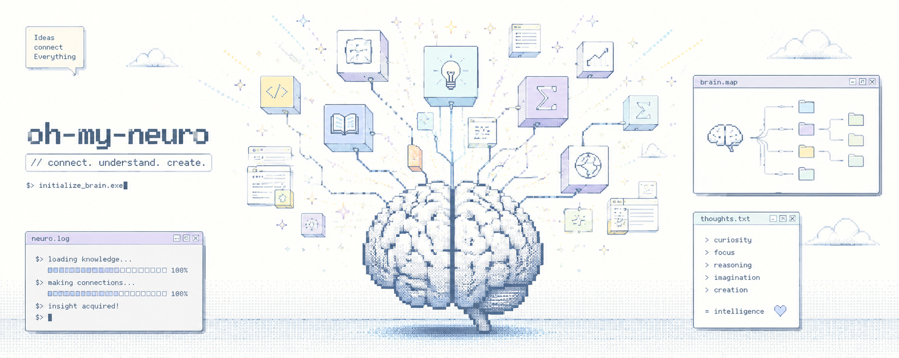

<div align="center">

<h1>OH-MY-NEURO</h1>

<h3>Local-first RAG workspace for private knowledge</h3>

<p><em>Ask your vault. Get cited answers.</em></p>

<p>
  
  
  
  
  
  
  
  
  
  
  
</p>

<p align="center">
  
</p>

<p>
  <a href="#features">Features</a> |
  <a href="#architecture">Architecture</a> |
  <a href="#tech-stack">Tech Stack</a> |
  <a href="#quick-start">Quick Start</a> |
  <a href="#usage">Usage</a> |
  <a href="#configuration">Configuration</a> |
  <a href="#development">Development</a>
</p>

</div>

---

OH-MY-NEURO turns a private document vault into a local RAG command center. It incrementally indexes documents, builds a generated Wiki, routes questions through LangGraph, and combines local, Wiki, and MCP evidence into cited answers.

## Features

| | Feature | Description |
| --- | --- | --- |
| ⚡ | Delta Vault Sync | Detects added, changed, and deleted files, then applies only the changes to Chroma. |
| 🧭 | Corrective RAG | Runs query rewriting, retrieval, relevance filtering, retries, and answer generation as a LangGraph state graph. |
| 🧠 | Generated Wiki | Organizes vault documents under `_omn_wiki` and provides an easy index, a knowledge graph, and Wiki-specific search. |
| 🔌 | MCP Routing | Routes legal questions to `korean_law` and current or web-oriented questions to `web_search` when needed. |
| 🌊 | Streaming Chat | Streams tokens, citations, errors, and web-search state to the UI and CLI over FastAPI NDJSON responses. |
| 📄 | PDF-Aware Ingestion | Uses PyMuPDF first, falls back to `pypdf`, and can invoke Tesseract OCR for scanned pages. |
| 🧩 | Local Vector Store | Keeps source documents and generated Wiki pages in separate local Chroma collections. |
| 🖥️ | CLI and Vite UI | Provides both the `oh-my-neuro` CLI and a Vite interface hosted by FastAPI. |

## Architecture

```text
+------------------+      +-------------------+      +-------------------+
| Vault directory  | ---> | Delta planner     | ---> | Document loaders  |
| PDF / DOCX / MD  |      | add/update/delete |      | PyMuPDF / pypdf   |
| TXT / Markdown   |      | hash + mtime      |      | docx / md / text  |
+------------------+      +-------------------+      +---------+---------+
                                                               |
                                                               v
                                                     +-------------------+
                                                     | Chunk + embed     |
                                                     | source metadata   |
                                                     +---------+---------+
                                                               |
                                                               v
                                                     +-------------------+
                                                     | Chroma collections|
                                                     | raw docs + wiki   |
                                                     +-------------------+

+------------+    +---------------+    +----------------+    +-----------+
| Question   | -> | prepare_query | -> | retrieve       | -> | grade     |
| + history  |    | rewrite seed  |    | raw + wiki     |    | relevance |
+------------+    +---------------+    +-------+--------+    +-----+-----+
                                            ^                    |
                                            |                    | weak/no docs
                                            +--- rewrite <-------+
                                                                 |
                                                                 | grounded or max rewrite
                                                                 v
                                                        +------------------+
                                                        | route by intent  |
                                                        | local / law / web|
                                                        +--------+---------+
                                                                 |
                                                                 v
                                                        +------------------+
                                                        | prepare_context  |
                                                        | docs + wiki + MCP|
                                                        +--------+---------+
                                                                 |
                                                                 v
                                                        +------------------+
                                                        | OpenAI answer    |
                                                        | with citations   |
                                                        +------------------+
```

Every retrieved result becomes a `Citation`. Wiki evidence, source-document evidence, and MCP law or web evidence are rendered into one context block for answer generation.

## Tech Stack

| Layer | Technology | Purpose |
| --- | --- | --- |
| API | FastAPI and Uvicorn | REST API, streaming API, and SPA hosting |
| UI | Vite, React, TypeScript, and Tailwind CSS | Chat, Vault, Wiki, Settings, and onboarding screens |
| Orchestration | LangGraph | Corrective RAG state graph |
| LLM | OpenAI through `langchain-openai` | Answer generation, query rewriting, and optional relevance grading |
| Embeddings | `text-embedding-3-large` | Document and Wiki vectorization |
| Vector Store | ChromaDB | Local retrieval index |
| Ingestion | PyMuPDF, pypdf, and python-docx | PDF, DOCX, text, and Markdown loading |
| External Tools | MCP and `langchain-mcp-adapters` | Legal search, web search, and user-defined MCP servers |
| Configuration | Pydantic, YAML, and environment variables | Application, model, retrieval, Wiki, MCP, and UI settings |
| Tooling | uv, pytest, Ruff, ESLint, and TypeScript | Installation, testing, linting, and builds |

## Supported Inputs

| Category | Extensions or Source | Loader | Notes |
| --- | --- | --- | --- |
| PDF | `.pdf` | PyMuPDF with pypdf fallback | Optional OCR when Tesseract is installed |
| Word | `.docx` | python-docx | Paragraph-level text extraction |
| Text | `.txt` | Built-in text loader | Plain-text documents |
| Markdown | `.md`, `.markdown` | Markdown or text loader | Regular notes and generated Wiki content |
| Wiki | `_omn_wiki/*.md` | Wiki vector store | Can be generated and indexed after sync |
| External | MCP law and web tools | MCP client | Called conditionally according to query intent |

## Quick Start

### Prerequisites

- Python 3.11 or later
- `uv`
- Node.js compatible with Vite 6
- An OpenAI API key for RAG and Wiki generation
- Optional Tesseract with Korean and English language data for scanned PDF OCR
- Optional `OPEN_LAW_ID` for the bundled Korean law MCP server

### Installation

```bash
git clone <repo-url>
cd oh-my-neuro

uv sync --project server --extra dev
npm ci --prefix client
```

Set the API key in the shell before launching the server:

```bash
export OPENAI_API_KEY=your_openai_api_key
```

You can also start the application without a key and add it from the Settings screen. The Settings API stores it in the ignored `server/.env` file and applies it immediately. A missing local environment file does not prevent the server from starting, but RAG features remain unavailable until a key is configured.

### Build and Run

```bash
npm run build --prefix client
uv run --project server oh-my-neuro ui
```

Open the local UI at `http://127.0.0.1:7860`.

For client development, run Vite and the API in separate terminals:

```bash
npm run dev --prefix client
```

```bash
uv run --project server oh-my-neuro ui
```

The Vite development server proxies `/api` requests to `http://127.0.0.1:7860`.

## Usage

Run CLI commands from the repository root with `uv run --project server`:

```bash
# Set the Vault directory
uv run --project server oh-my-neuro vault ~/Documents/my-vault

# Preview sync changes without writing to Chroma
uv run --project server oh-my-neuro sync --dry-run

# Index changed files and rebuild the Wiki when enabled
uv run --project server oh-my-neuro sync

# Ask a question using local Vault and Wiki context
uv run --project server oh-my-neuro ask "Summarize the action items from the latest meeting notes."

# Stream the answer in the terminal
uv run --project server oh-my-neuro ask "Summarize the termination clauses in the contract." --stream

# Inspect local state
uv run --project server oh-my-neuro status
uv run --project server oh-my-neuro list

# Rebuild and validate the generated Wiki
uv run --project server oh-my-neuro wiki rebuild
uv run --project server oh-my-neuro wiki lint

# Clear all indexed chunks
uv run --project server oh-my-neuro clear --force
```

### CLI Reference

| Command | Purpose |
| --- | --- |
| `ui` | Start the FastAPI server and hosted Vite UI. This is the default command. |
| `vault <path>` | Set the document Vault directory. |
| `sync [--dry-run]` | Plan or apply an incremental Vault sync. |
| `status` | Summarize Vault, sync, and index state. |
| `ask <question> [--stream]` | Ask a RAG question, optionally with streamed output. |
| `list` | List indexed source files. |
| `clear --force` | Clear the Chroma index. |
| `wiki status` | Show Wiki state. |
| `wiki rebuild` | Regenerate and index Wiki pages. |
| `wiki lint` | Validate generated Wiki pages. |

### HTTP API

| Endpoint | Purpose |
| --- | --- |
| `POST /api/chat` | Generate one RAG response. |
| `POST /api/chat/stream` | Stream an NDJSON RAG response. |
| `GET /api/vault/status` | Read Vault, index, and Wiki state. |
| `POST /api/vault/sync` | Stream Vault synchronization progress. |
| `GET /api/vault/files` | List indexed files. |
| `GET /api/wiki/pages` | List generated Wiki pages. |
| `GET /api/wiki/easy-index` | Search across source documents and the Wiki. |
| `GET /api/wiki/graph` | Read the Wiki concept graph. |
| `GET /api/settings` | Read effective settings. |
| `GET /api/settings/mcp/servers` | List configured MCP servers. |

## Configuration

Configuration is layered in this order:

| Source | Purpose |
| --- | --- |
| `server/configs/app.yaml` | Default application, model, retrieval, storage, Wiki, MCP, and UI settings |
| Shell environment or `server/.env` | Local secrets such as `OPENAI_API_KEY` and runtime overrides such as `OMN_LOG_LEVEL` |
| `server/configs/mcp_servers.yaml` | Bundled MCP server definitions |
| `~/.oh-my-neuro/mcp_servers.yaml` | User MCP definitions managed from the Settings screen |

Default model and retrieval settings:

```yaml
llm:
  chat_model: gpt-5.4-mini
  grader_model: gpt-5.4-nano
  rewriter_model: gpt-5.4-nano
  embedding_model: text-embedding-3-large

retrieval:
  top_k: 5
  fetch_k: 12
  chunk_size: 1000
  chunk_overlap: 150
  max_rewrites: 1
```

Bundled MCP servers:

```yaml
servers:
  korean_law:
    transport: stdio
    command: uvx
    args: [korean-law-mcp]
    env:
      OPEN_LAW_ID: $OPEN_LAW_ID
    enabled: true
  web_search:
    transport: stdio
    command: uvx
    args: [duckduckgo-mcp-server]
    env:
      DDG_REGION: kr-kr
      DDG_SAFE_SEARCH: moderate
    enabled: true
```

You can add `stdio`, HTTP, and SSE-compatible MCP servers from Settings. Opening Settings does not start external servers. Connections are created only for a connection check or an actual search.

## Project Structure

The repository root intentionally contains only the following five entries:

```text
oh-my-neuro/
├── client/
│   ├── public/                 # README and Vite-served static assets
│   ├── src/                    # React application
│   ├── package.json            # client scripts and dependencies
│   └── vite.config.ts          # Vite configuration and API proxy
├── server/
│   ├── app/                    # FastAPI, CLI, RAG, ingestion, and storage code
│   ├── configs/                # application and MCP defaults
│   ├── tests/                  # pytest suite
│   ├── README.md               # Python package description
│   ├── pyproject.toml          # Python package and tool configuration
│   └── uv.lock                 # locked Python dependencies
├── README.md
├── LICENSE
└── CONTRIBUTING.md
```

## Development

Run all checks from the repository root:

```bash
# Server tests
uv run --project server pytest server/tests

# Server lint
uv run --project server ruff check server/app server/tests

# Client lint
npm run lint --prefix client

# Client type-check and production build
npm run build --prefix client
```

There is no client test runner yet. Validate UI changes with ESLint, the Vite production build, and a manual browser check.

### Design Principles

| Principle | Implementation |
| --- | --- |
| Local-first | Vault files, Chroma data, generated Wiki pages, and user MCP configuration stay on the local machine. |
| Source-grounded | Answers are generated from rendered context and returned with citations. |
| Progressive external search | MCP law and web tools run only when deterministic routing rules determine they are useful. |
| Graceful fallback | PDF parsing, LLM grading, query rewriting, Wiki retrieval, and MCP calls have fallback paths. |
| Config-driven | YAML, environment variables, and the Settings UI control runtime behavior. |
| Korean-first workflow | UI copy, legal routing keywords, and OCR defaults are tuned for Korean and English documents. |

## Security Notes

- Never commit API keys, Vault documents, Chroma data, generated Wiki pages, or build output.
- The Settings API stores `OPENAI_API_KEY` in `server/.env` with restricted file permissions and never returns the key value.
- External MCP servers may access network resources. Review `server/configs/mcp_servers.yaml` and user-added server definitions before enabling them.
- Vault file opening is path-checked against the configured Vault root.

## License

See [LICENSE](LICENSE).
